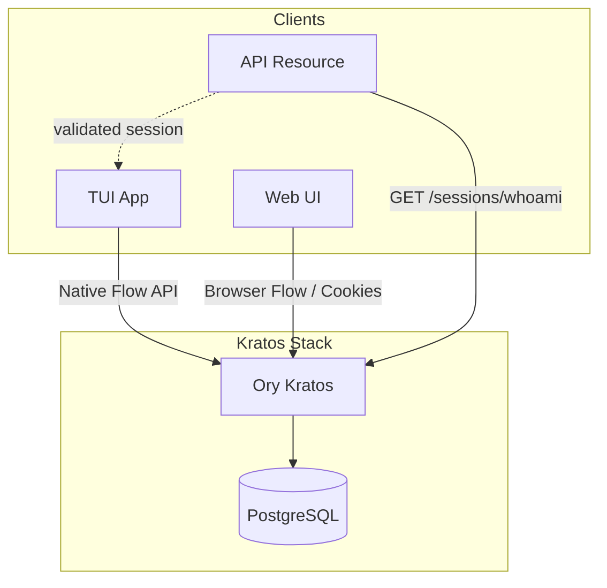
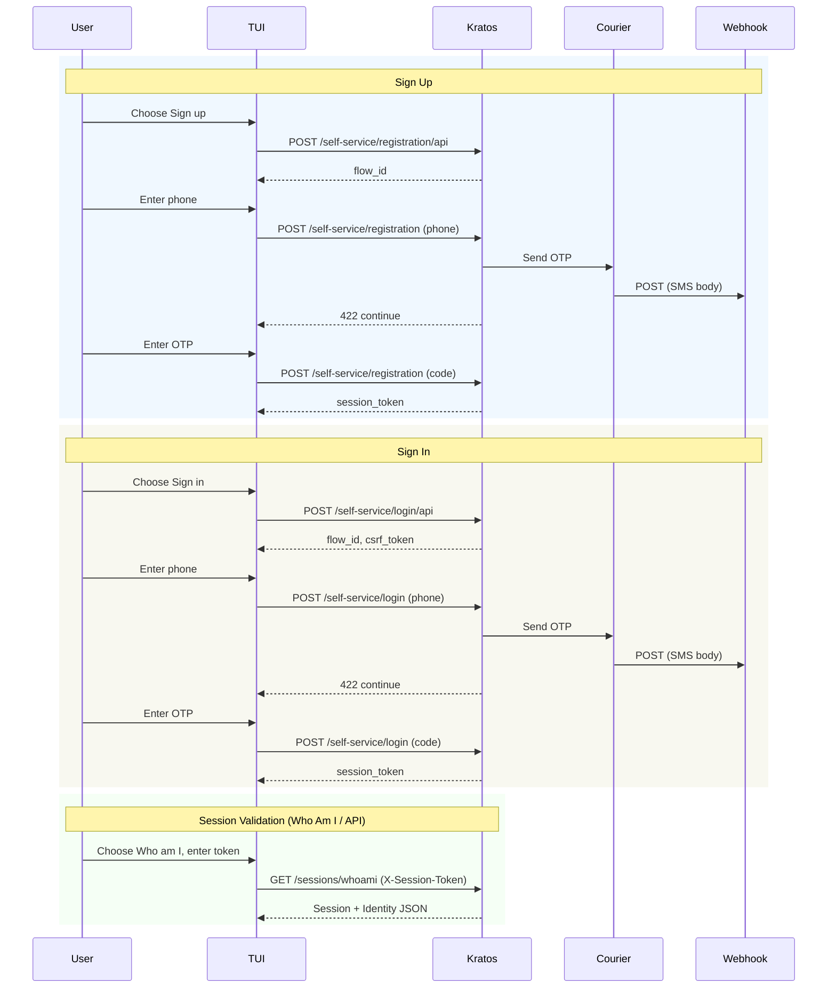

# Ory Kratos Passwordless Auth Demo

A demo of [Ory Kratos](https://www.ory.sh/kratos) configured for passwordless authentication using phone + SMS OTP. The project includes a custom native client TUI that demonstrates how the Native Flow API works, along with Docker Compose running Kratos with PostgreSQL and the reference Web UI for browser-based login and signup flows.

**Read more:** [Ory Kratos: Enterprise Identity Management](https://martavoi.by/posts/ory-kratos-identity-management/) — blog post describing the purpose of this demo and Kratos in general (identity vs OAuth, credential types, hooks, native vs browser flows).

## Prerequisites

- Docker and Docker Compose
- Go 1.21+ (for native client build)
- [Webhook.site](https://webhook.site) account (for SMS OTP delivery in development)

## Quick Start

```bash
# 1. Configure environment
cp .env.example .env
# Edit .env and set SMS_WEBHOOK_URL to your webhook.site URL

# 2. Start Kratos stack
docker-compose up -d

# 3. Access Web UI (browser flows)
# Open http://127.0.0.1:4455

# 4. Build and run Native client (native flows)
cd native-client && go build -o native-client . && ./native-client
```

## Architecture



- **Kratos**: Central auth; handles registration, login, session management
- **PostgreSQL**: Persistent storage for identities and sessions
- **TUI App**: Uses Native Flow API (flows, session token)
- **Web UI**: Uses browser flows (cookies)
- **API Resource**: External service (not in this repo); validates sessions via `GET /sessions/whoami` (Who Am I endpoint; auth via `X-Session-Token` or `Cookie`)

## Native Client (TUI)

The native client is an interactive TUI built with [Bubble Tea](https://github.com/charmbracelet/bubbletea). It demonstrates how a native app (mobile, CLI, desktop) interacts with Kratos using the Native Flow API—no browser required.

### Features

| Feature | Description |
|---------|-------------|
| **Sign up** | Registration flow: phone → OTP (webhook.site) → code → session token |
| **Sign in** | Login flow: phone → OTP → code → session token |
| **Who am I** | Validates session via `GET /sessions/whoami`; shows session/identity JSON |

### HTTP API Log

Press **Ctrl+L** from any screen to toggle the HTTP API log view. This shows requests and responses in real time, making it easy to understand the interaction between the native app and Kratos:

- Format: `→ REQUEST <method>`, `← RESPONSE <method> status=<code>`, with bodies
- **Ctrl+Y** copies the full log to clipboard (when in log view)
- **Esc** or **Ctrl+L** returns from the log view

### Usage

```bash
# Interactive menu
./native-client

# Direct subcommands
./native-client signup
./native-client signin
./native-client whoami

# Options
./native-client --url http://127.0.0.1:4433 --verbose signup
```

| Flag | Description |
|------|-------------|
| `--url`, `-u` | Kratos public URL (default: `http://127.0.0.1:4433`) |
| `--verbose`, `-v` | Verbose HTTP/JSON logging |

## Native Flow Sequence



## Protecting API Resources

An external API (not in this repo) can protect its endpoints by validating sessions with Kratos:

1. **Call** `GET /sessions/whoami` (Who Am I endpoint; SDK operation: `ToSession`)
2. **Auth**: Pass `X-Session-Token` header (native apps) or `Cookie` (browsers)
3. **200** → valid session; use `identity` for authorization
4. **401** → unauthenticated; redirect to login

Example: API receives request → forwards `X-Session-Token` (native) or `Cookie` (browser) to `GET /sessions/whoami` → allows or denies based on 200 vs 401.

## Project Layout

```
krts/
├── native-client/       # Native client TUI (Go)
│   ├── internal/        # Kratos API clients, login, registration, session
│   └── ui/              # Bubble Tea UI
├── kratos/              # Kratos config
│   ├── kratos.yml
│   └── identity.phone-sms.schema.json
├── docker-compose.yml
└── .env.example
```

## Configuration

| Variable | Description |
|----------|-------------|
| `DSN` | PostgreSQL connection string |
| `COOKIE_SECRET`, `CSRF_COOKIE_SECRET` | Self-service UI (browser flows) |
| `SMS_WEBHOOK_URL` | Webhook.site URL for OTP delivery in dev |

See [.env.example](.env.example) for the full template.
